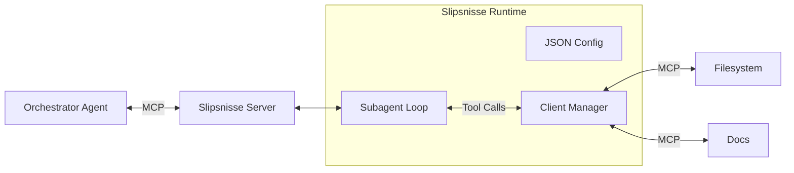

# Slipsnisse


**Slipsnisse** (*noun, Swedish*): Lit. *"Tie-Gnome"*.
A slightly derogatory term for a corporate drone or "suit" who focuses on superficial process and career climbing rather than deep substance.

**Slipsnisse** is a hierarchical Model Context Protocol (MCP) server that acts as a "middle manager" subagent. It offloads verbose, context-heavy tasks from expensive orchestrator agents to faster, cheaper models.

## How it works

Slipsnisse creates a semantic buffer:
1. **The orchestrator** (e.g., Claude Opus 4.5) sees a clean "Expert Tool".
2. **Slipsnisse** coordinates downstream MCPs (filesystem, docs, search) and cheaper "Flash" models (e.g., Gemini 3 Flash) to execute complex workflows.
3. **The Result** is synthesized and returned to the orchestrator, keeping its context window clean.

## Architecture



## Features

- **Hierarchical Delegation:** Decouple expensive reasoning from verbose tool usage.
- **Dynamic Tooling:** Composite tools are defined in a simple JSON configuration.
- **Vercel AI SDK Integration:** Supports Google, OpenAI, Anthropic, and other providers.
- **Environment Variable Substitution:** Securely manage secrets in your config using `${VAR_NAME}` syntax.
- **Tool Namespacing:** Automatically handles collisions between multiple downstream MCP servers.
- **Low Overhead:** Lightweight Node.js runtime using `pnpm` and `tsx`.

## Getting Started

### Installation

```bash
pnpm install
```

### Usage

Launch Slipsnisse with a path to your configuration file:

```bash
npx slipsnisse --config ./config.json --log-level info
```

### Using Additional Providers

Slipsnisse comes with core providers pre-installed. To use additional Vercel AI SDK providers (like `@ai-sdk/azure` or `@ai-sdk/mistral`) when running via `npx`, inject them using the `-p` flag:

```bash
npx -p slipsnisse -p @ai-sdk/mistral -p @ai-sdk/azure slipsnisse --config ./config.json
```

### Configuration

Slipsnisse is driven by a JSON configuration file. You can find example configurations in the [`examples/`](./examples) directory.

#### Environment Variables

You can use `${VAR_NAME}` syntax anywhere in the configuration values (args, env, apiKey, etc.) to substitute parameters from the process environment.

#### Example Config

```json
{
  "providers": {
    "google": {
      "provider": "google",
      "apiKey": "${GEMINI_API_KEY}"
    }
  },
  "mcps": {
    "filesystem": {
      "command": "npx",
      "args": ["-y", "@modelcontextprotocol/server-filesystem", "/src"]
    }
  },
  "tools": [
    {
      "name": "research_files",
      "description": "Analyzes project files to answer specific questions.",
      "internal_tools": {
        "filesystem": ["read_file", "list_directory"]
      },
      "provider": "google",
      "model": "gemini-3-flash-exp",
      "temperature": 0.3,
      "system_prompt": "You are a senior engineer. Use the filesystem to research the codebase."
    }
  ]
}
```

## CLI Arguments

- `--config <path>`: Path to JSON config (required).
- `--log-level <level>`: `debug`, `info`, `warn`, `error` (default: `info`).
- `--log-pretty`: Enable human-readable logging.

## Security

Slipsnisse executes binaries defined in the `mcps` configuration. It should only be run in trusted environments. Tool whitelisting ensures subagents only access explicitly granted capabilities.

## License

WIP, TBC
