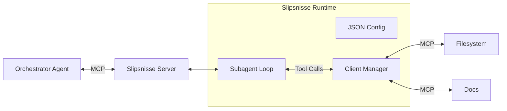

# Slipsnisse

**Slipsnisse** ("Tie Gnome") is a hierarchical Model Context Protocol (MCP) server that acts as a "middle manager" subagent. It offloads verbose, context-heavy tasks from expensive Orchestrator agents to faster, cheaper models.

## How it works

Slipsnisse creates a semantic buffer:
1. **The Orchestrator** (e.g., Claude 3.5 Sonnet) sees a clean "Expert Tool".
2. **Slipsnisse** coordinates downstream MCPs (filesystem, docs, search) and cheaper "Flash" models (e.g., Gemini 2.0 Flash) to execute complex workflows.
3. **The Result** is synthesized and returned to the Orchestrator, keeping its context window clean.

## Architecture



## Features

- **Hierarchical Delegation:** Decouple expensive reasoning from verbose tool usage.
- **Dynamic Tooling:** Composite tools are defined in a simple JSON configuration.
- **Vercel AI SDK Integration:** Supports Google, OpenAI, Anthropic, and other providers.
- **Tool Namespacing:** Automatically handles collisions between multiple downstream MCP servers.
- **Low Overhead:** Lightweight Node.js runtime using `pnpm` and `tsx`.

## Getting Started

### Installation

```bash
pnpm install
```

### Usage

Launch Slipsnisse with a path to your configuration file:

```bash
npx slipsnisse --config ./config.json --log-level info
```

### Configuration

Slipsnisse is driven by a JSON configuration file. 

```json
{
  "mcps": {
    "filesystem": {
      "command": "npx",
      "args": ["-y", "@modelcontextprotocol/server-filesystem", "/src"]
    }
  },
  "tools": [
    {
      "name": "research_files",
      "description": "Analyzes project files to answer specific questions.",
      "internal_tools": {
        "filesystem": ["read_file", "list_directory"]
      },
      "provider": "google",
      "model": "gemini-2.0-flash-001",
      "system_prompt": "You are a senior engineer. Use the filesystem to research the codebase."
    }
  ]
}
```

## CLI Arguments

- `--config <path>`: Path to JSON config (required).
- `--log-level <level>`: `debug`, `info`, `warn`, `error` (default: `info`).
- `--log-pretty`: Enable human-readable logging.

## Security

Slipsnisse executes binaries defined in the `mcps` configuration. It should only be run in trusted environments. Tool whitelisting ensures subagents only access explicitly granted capabilities.

## License

ISC
