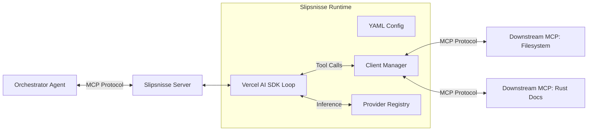

# Technical Design Document: Slipsnisse (The Subagent MCP)

## 1. Executive Summary

**Slipsnisse** ("Tie Gnome") is a hierarchical Model Context Protocol (MCP) server that acts as a "middle manager" subagent. Its primary purpose is to offload verbose, context-heavy tasks (like documentation research, file reading, and synthesis) from expensive Orchestrator agents (Claude 3.5 Sonnet, GPT-4o) to cheaper, faster models (Gemini Flash), acting as a semantic buffer.

It creates an abstraction layer: the Orchestrator sees a clean "Expert Tool," while Slipsnisse frantically coordinates downstream MCPs and cheaper LLMs in the background to produce the result.

## 2. System Architecture

### 2.1 High-Level Data Flow



### 2.2 Core Libraries

* **Protocol Plumbing:** `@modelcontextprotocol/sdk`
  * Used for the **Server** (exposed to Host).
  * Used for **Clients** (connecting to downstream tools).
  * Supports both `Stdio` (default) and `SSE` transports.

* **Intelligence:** `ai` (Vercel AI SDK v6)
  * **Providers:** All providers exposed by Vercel AI SDK v6 (Google, OpenAI, Anthropic, etc.). Provider availability is introspected from SDK types.

* **Validation:** `zod`
* **Config:** JSON with JSON Schema validation
* **Logging:** `pino` + `pino-pretty`
* **Testing:** `vitest`
* **Package Manager:** `pnpm`
* **Runtime:** Node.js with `tsx` for development

## 3. Configuration Schema

The behavior is driven entirely by a JSON configuration file.

**Runtime Requirement:** Slipsnisse **must** be launched with a pointer to this config file.
```bash
npx slipsnisse --config ./slipsnisse.config.json --log-level info
```

**CLI Arguments:**
* `--config <path>` — Path to JSON config file (required)
* `--log-level <level>` — Log level: `debug`, `info`, `warn`, `error` (default: `info`)
* `--log-pretty` — Enable human-readable log output (default: JSON)

### 3.1 Schema Definition

```json
{
  "mcps": {
    "<server_id>": {
      "command": "<string>",
      "args": ["<string>"],
      "env": { "<key>": "<value>" },
      "transport": "stdio | sse",
      "url": "<string for SSE transport>"
    }
  },
  "tools": [
    {
      "name": "<string>",
      "description": "<string>",
      "arguments": { "<JSON Schema>" },
      "internal_tools": {
        "<server_id>": ["<tool_name>"]
      },
      "provider": "<string>",
      "model": "<string>",
      "system_prompt": "<string (optional)>"
    }
  ]
}
```

**Notes:**
* `transport` defaults to `"stdio"` if omitted
* `url` is required when `transport: "sse"`
* `provider` accepts any provider supported by Vercel AI SDK v6

### 3.2 Example Configuration

```json
{
  "mcps": {
    "filesystem": {
      "command": "npx",
      "args": ["-y", "@modelcontextprotocol/server-filesystem", "/src"]
    },
    "rust_docs": {
      "command": "uvx",
      "args": ["mcp-rust-docs"]
    }
  },
  "tools": [
    {
      "name": "research_dependency",
      "description": "Finds optimal libraries and usage examples for a specific programming problem.",
      "arguments": {
        "type": "object",
        "properties": {
          "query": { "type": "string" }
        },
        "required": ["query"]
      },
      "internal_tools": {
        "filesystem": ["read_file", "list_directory"],
        "rust_docs": ["search", "read_page"]
      },
      "provider": "google",
      "model": "gemini-2.0-flash-001",
      "system_prompt": "You are a Rust expert. Search docs, read files to check compatibility, and synthesize an answer."
    }
  ]
}
```

### 3.3 JSON Schema

For validation and reusability, strict adherence to this schema is required.

```json
{
  "$schema": "[http://json-schema.org/draft-07/schema#](http://json-schema.org/draft-07/schema#)",
  "type": "object",
  "properties": {
    "mcps": {
      "type": "object",
      "description": "Map of downstream MCP server configurations",
      "additionalProperties": {
        "type": "object",
        "properties": {
          "command": { "type": "string" },
          "args": { "type": "array", "items": { "type": "string" } },
          "env": { "type": "object", "additionalProperties": { "type": "string" } },
          "transport": { "type": "string", "enum": ["stdio", "sse"], "default": "stdio" },
          "url": { "type": "string", "description": "Required when transport is sse" }
        },
        "required": ["command", "args"]
      }
    },
    "tools": {
      "type": "array",
      "description": "List of composite tools exposed by Slipsnisse",
      "items": {
        "type": "object",
        "properties": {
          "name": { "type": "string" },
          "description": { "type": "string" },
          "arguments": { "type": "object", "description": "Input schema (JSON Schema format)" },
          "internal_tools": {
            "type": "object",
            "description": "Map of server_id to list of allowed tool names",
            "additionalProperties": {
              "type": "array",
              "items": { "type": "string" }
            }
          },
          "provider": { "type": "string", "description": "Any Vercel AI SDK v6 provider (google, openai, anthropic, etc.)" },
          "model": { "type": "string" },
          "system_prompt": { "type": "string" }
        },
        "required": ["name", "description", "internal_tools", "provider", "model"]
      }
    }
  },
  "required": ["mcps", "tools"]
}

```

## 4. Implementation Details

### 4.1 The Provider Registry

To minimize memory footprint, we strictly load only the providers required by the active configuration using dynamic imports.

```typescript
// Pseudo-implementation of Dynamic Provider Factory
const providerCache = new Map();

async function getModel(providerName: string, modelId: string) {
  if (!providerCache.has(providerName)) {
    // Dynamic import avoids loading unused SDKs (e.g., openai if only using google)
    try {
      const pkgName = `@ai-sdk/${providerName}`; 
      const module = await import(pkgName);
      
      // Vercel SDK providers usually export a function matching the provider name
      // e.g., import { google } from '@ai-sdk/google'
      providerCache.set(providerName, module[providerName] || module.default);
    } catch (e) {
      throw new Error(`Failed to load provider '${providerName}'. Is it installed?`);
    }
  }

  const providerFn = providerCache.get(providerName);
  return providerFn(modelId);
}

```

### 4.2 The Client Manager & Namespacing

To avoid tool name collisions, the Client Manager uses a composite key strategy internally.

* **Config:** `internal_tools: { filesystem: ['read_file'] }`
* **Internal Map:** `filesystem::read_file` -> `ClientInstance`

When the Subagent LLM decides to call `read_file`, it must pick from the tools injected into its context. We will inject them with namespaced names (e.g., `filesystem__read_file`) to ensure the model distinguishes between multiple `search` or `read` tools from different servers.

### 4.3 The Execution Engine (Vercel AI SDK Integration)

When the Orchestrator calls a Slipsnisse tool:

1. **Hydration:**
* Load `system_prompt` (or default generic prompt).
* Resolve `provider` + `model` using the Dynamic Provider Registry.
* Resolve `internal_tools` to a list of executable functions wrapping `client.callTool()`.

2. **The Loop (`generateText`):**
* We use `generateText` with `maxSteps: 10`.
* This built-in loop handles the recursive "Thinking -> Tool Call -> Result -> Thinking" cycle.

3. **Output:**
* The final text generated by the loop is returned to the Orchestrator.
* Intermediate "thinking" steps are discarded (or optionally logged for debug), keeping the Orchestrator's context clean.

### 4.4 Startup Behavior

* **Eager Initialization:** All downstream MCPs are spawned at startup.
* **Availability Tracking:** Only tools backed by successfully connected MCPs are registered.
* **Startup Errors:** Failures to spawn MCPs are logged but do not prevent server startup.

### 4.5 Error Handling

* **Process Death:** If a downstream MCP dies, Slipsnisse throws a `ToolExecutionError` to the Orchestrator. (Auto-restart is out of scope for MVP).
* **Context Overflow:** We rely on the large context windows of modern "Flash/Mini" models.
* **Timeout:** A global `AbortSignal` (e.g., 60s) is passed to `generateText`.
* **Logging:** All errors are logged via Pino with full context for debugging.

## 5. Development Roadmap (MVP)

1. **Phase 1: The Office (Infrastructure)**
* Implement `ConfigLoader` (YAML + Zod validation).
* Implement `ClientManager` using `@modelcontextprotocol/sdk` to connect to `stdio` processes.

2. **Phase 2: The Bureaucracy (Server)**
* Initialize the Slipsnisse `McpServer`.
* Dynamically register tools based on the `tools` array in config.

3. **Phase 3: The Delegation (Intelligence)**
* Implement the `ProviderFactory` with dynamic imports.
* Wire up `generateText` inside the tool handler.
* Implement tool wrapping (converting MCP JSON-RPC calls to Vercel SDK tools).


## 6. Security Considerations

* **Execution Policy:** Slipsnisse executes arbitrary binaries defined in `mcps`. It must strictly run in a trusted environment (e.g., local dev or secured container).
* **Tool Isolation:** The `internal_tools` whitelist is enforced. A subagent strictly cannot access tools not assigned to it, preventing a compromised sub-model from accessing sensitive tools (e.g., file delete) if they aren't explicitly granted.
